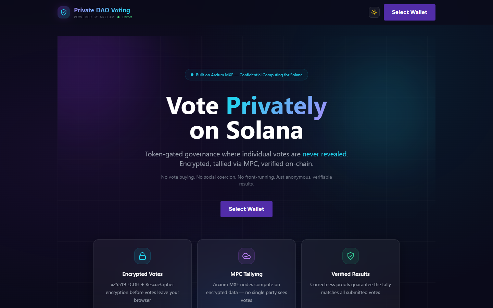
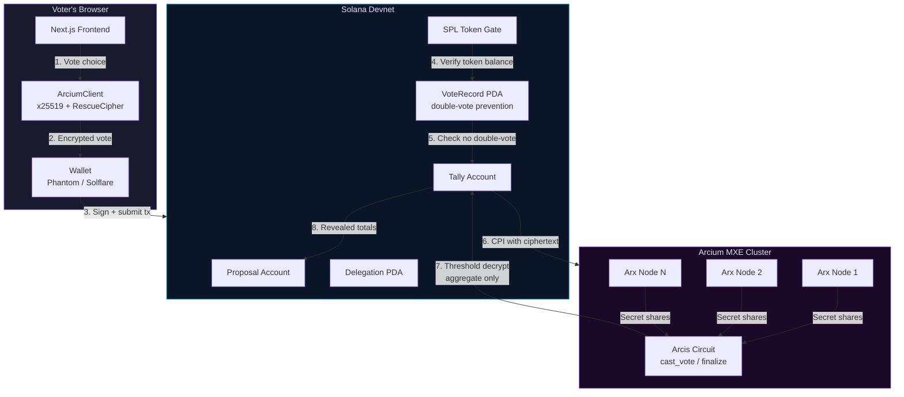

# Private DAO Voting

[](https://github.com/Ridwannurudeen/private-dao-voting/actions/workflows/ci.yml)

**Confidential governance on Solana, powered by Arcium's Multi-Party Computation.**

**[Live Demo](https://privatedao-arcium.vercel.app/)** | [GitHub](https://github.com/Ridwannurudeen/private-dao-voting)

Votes are encrypted client-side, tallied inside Arcium's MXE without ever being decrypted, and only the final aggregate result is published on-chain — with correctness proofs. No one (not validators, not the DAO authority, not other voters) can see how any individual voted.

---

## Demo

<!-- Replace with your recorded demo GIF showing the full voting flow -->
<!--  -->

| Landing Page (Dark) | Feature Cards | Light Theme | How It Works |
|:---:|:---:|:---:|:---:|
|  |  |  |  |
| Hero with "Vote Privately on Solana" and wallet connect | Encrypted Votes, MPC Tallying, Verified Results cards with tech badges | Full light theme support with localStorage persistence | Interactive 5-step guided walkthrough |

> **Try it live:** [privatedao-arcium.vercel.app](https://privatedao-arcium.vercel.app/) — Connect a Solana devnet wallet to create proposals and cast encrypted votes.

**Key UI features:**
- Animated encryption visualization — hex particles flow into a lock during vote encryption
- Confetti celebration on successful vote submission
- Real-time countdown timers with urgency pulse (< 5 min remaining)
- Shimmer-animated encrypted vote vault showing sealed votes
- Privacy integrity progress bar during vote encryption
- Interactive "How It Works" 5-step guided walkthrough
- Dark/light theme toggle with localStorage persistence
- Keyboard shortcuts (`N` new, `R` refresh, `Esc` close)
- Live on-chain activity feed
- Participation stats dashboard
- Shareable proposal links (`/proposal/[id]`)
- Export results as CSV/JSON
- Solana Explorer links in toast notifications
- User-friendly error messages for Anchor errors
- Mobile-responsive design
- PWA-installable (manifest.json)

---

## Why Private Voting Matters

Public on-chain voting is broken:

| Problem | Impact |
|---------|--------|
| **Vote buying** | Buyers can verify how you voted and pay/punish accordingly |
| **Social coercion** | Whales and leaders influence others by voting first |
| **Front-running** | MEV bots and last-minute voters game the outcome |
| **Voter apathy** | People abstain rather than face backlash for unpopular positions |

Private DAO Voting eliminates all four. Your vote is encrypted the moment you click — the tally happens inside Arcium's encrypted shared state, and only the final result is ever revealed.

### Privacy Benefits Provided by Arcium

| Benefit | How Arcium Delivers It |
|---------|----------------------|
| **Vote secrecy** | Individual votes are encrypted with x25519 ECDH + RescueCipher before leaving the browser. The MXE processes votes as `Enc<Shared, u8>` secret shares — no single Arx Node ever sees a plaintext vote. |
| **Coercion resistance** | Since votes are never individually decryptable (not even by the DAO authority or Solana validators), no one can prove how you voted. Vote buying becomes economically irrational. |
| **Tally integrity** | Arcium's MXE produces cryptographic correctness proofs that the published aggregate (yes/no/abstain counts) is the mathematically valid sum of all encrypted inputs. The result is verifiable without revealing individual votes. |
| **Front-running prevention** | Encrypted tally state is opaque until `finalize_and_reveal` is called after the voting deadline. No one can see interim results and vote strategically. |
| **Threshold trust model** | Votes are split into secret shares across multiple independent Arx Nodes. Compromising a single node reveals nothing — an attacker would need to collude with a threshold of nodes to break privacy. |
| **Minimal on-chain footprint** | Only encrypted ciphertext is stored on Solana. The decryption and aggregation happen inside the MXE, so the blockchain never contains plaintext vote data — not during voting, not after reveal. |

---

## How Arcium Makes This Possible

### The Privacy Flow

```
  Voter's Browser              Solana Program              Arcium MXE Cluster
  ================             ==============              ==================

  1. Choose YES/NO/ABSTAIN
         │
         ▼
  2. Encrypt with x25519
     + RescueCipher
     (vote → ciphertext)
         │
         ▼
  3. Submit encrypted    ────►  4. Verify token gate
     vote on-chain              Check double-vote PDA
                                Store ciphertext
                                         │
                                         ▼
                                5. CPI to Arcium  ────►  6. MPC nodes receive
                                   (queue computation)      encrypted vote shares
                                                                    │
                                                                    ▼
                                                            7. Homomorphic tally
                                                               (add encrypted
                                                                values without
                                                                decrypting them)
                                                                    │
                                         ┌──────────────────────────┘
                                         ▼
                                8. Callback with          9. Aggregate result
                                   revealed tally  ◄────     decrypted ONLY as
                                   (yes, no, abstain)        a final sum
                                         │
                                         ▼
                                10. Public result
                                    stored on Solana
                                    (individual votes
                                     remain secret forever)
```

### What Arcium's MXE Actually Does

The **MXE (Multi-Party Computation eXecution Environment)** is a cluster of independent nodes (Arx Nodes) that collectively compute on encrypted data:

1. **Secret Sharing** — Each encrypted vote is split into cryptographic shares distributed across nodes. No single node holds enough information to reconstruct any vote.

2. **Encrypted Computation** — The Arcis circuit (`cast_vote`) runs inside the MXE, performing arithmetic on `Enc<Shared, u64>` values. The addition `state.encrypted_yes_votes + is_yes` happens on ciphertext — the nodes never see plaintext.

3. **Threshold Decryption** — Only `finalize_and_reveal` triggers decryption, and only for the aggregate totals. Individual vote values are never reconstructed.

4. **Correctness Proofs** — The MXE produces cryptographic proofs that the published result is the correct aggregation of all submitted votes, without revealing any individual vote.

### The Arcis Circuit

The core privacy logic lives in `arcis/voting-circuit/src/lib.rs`:

```rust
#[arcis::export]
pub fn cast_vote(
    state: VotingState,
    encrypted_vote: Enc<Shared, u8>,  // 0=NO, 1=YES, 2=ABSTAIN
) -> VotingState {
    // Encrypted comparisons — no values are revealed
    let is_yes: Enc<Shared, u64> = encrypted_vote.eq(&Enc::new(1u8)).cast();
    let is_no: Enc<Shared, u64> = encrypted_vote.eq(&Enc::new(0u8)).cast();
    let is_abstain: Enc<Shared, u64> = encrypted_vote.eq(&Enc::new(2u8)).cast();

    VotingState {
        encrypted_yes_votes: state.encrypted_yes_votes + is_yes,
        encrypted_no_votes: state.encrypted_no_votes + is_no,
        encrypted_abstain_votes: state.encrypted_abstain_votes + is_abstain,
        encrypted_total_votes: state.encrypted_total_votes + Enc::new(1u64),
    }
}
```

Key design decisions:
- **Constant-time comparisons** — `eq()` + `cast()` avoids branching on secret values (MPC cannot branch on encrypted data)
- **No early reveal** — the circuit never calls `.reveal()` on individual votes or intermediate state
- **Three-way vote** — YES/NO/ABSTAIN support via encrypted boolean flags, not arithmetic that could underflow

---

## Architecture

```
private-dao-voting/
├── arcis/voting-circuit/          # Arcis MPC circuit (Rust)
│   └── src/lib.rs                 #   VotingState, cast_vote, finalize_and_reveal
├── programs/private-dao-voting/   # Anchor/Solana program (Rust)
│   └── src/lib.rs                 #   On-chain logic, token gating, delegation, quorum
├── tests/                         # Anchor integration tests
│   └── private-dao-voting.test.ts #   Lifecycle, voting, quorum, delegation, access control
├── frontend/
│   ├── pages/
│   │   ├── index.tsx              #   Main voting interface
│   │   ├── proposal/[id].tsx      #   Shareable proposal detail page
│   │   ├── _app.tsx               #   OG meta, PWA manifest, theme
│   │   └── api/faucet.ts          #   Rate-limited dev token faucet
│   ├── components/
│   │   ├── ProposalCard.tsx       #   Proposal display, voting, countdown, export
│   │   ├── CreateModal.tsx        #   Proposal creation form
│   │   ├── EncryptionAnimation.tsx #  Particle animation during vote encryption
│   │   ├── Confetti.tsx           #   Celebration effect on successful vote
│   │   ├── HowItWorks.tsx         #   Interactive 5-step walkthrough
│   │   ├── ThemeToggle.tsx        #   Dark/light mode toggle
│   │   ├── StatsBar.tsx           #   Participation stats dashboard
│   │   ├── ActivityFeed.tsx       #   On-chain event feed
│   │   ├── ExportResults.tsx      #   CSV/JSON result export
│   │   ├── PrivacyProtocol.tsx    #   Privacy tech explainer
│   │   ├── SkeletonCard.tsx       #   Shimmer loading placeholder
│   │   ├── Modal.tsx              #   Accessible modal with focus trap
│   │   ├── Toast.tsx              #   Notifications with Explorer links
│   │   ├── ErrorBoundary.tsx      #   Crash recovery wrapper
│   │   └── Icons.tsx              #   SVG icon components
│   ├── hooks/
│   │   └── useKeyboardShortcuts.ts #  Keyboard shortcut handler
│   ├── lib/
│   │   ├── arcium.ts              #   Arcium client (encryption, MXE integration)
│   │   ├── contract.ts            #   Solana program helpers (PDAs, delegation, retry)
│   │   ├── errors.ts              #   Error parsing + Explorer URL helper
│   │   └── retry.ts               #   Exponential backoff for RPC calls
│   ├── e2e/
│   │   └── voting-flow.spec.ts    #   Playwright E2E tests
│   └── public/
│       ├── favicon.svg            #   Custom shield+lock SVG favicon
│       └── manifest.json          #   PWA manifest
├── scripts/                       # Devnet setup and testing
├── CONTRIBUTING.md                # Development workflow + security guidelines
└── .github/workflows/ci.yml      # CI pipeline
```

### Component Interaction

```
┌─────────────────────────────────────────────────────────────────────┐
│  Frontend (Next.js)                                                 │
│  ┌──────────────┐  ┌───────────────────┐  ┌──────────────────────┐ │
│  │ Wallet       │  │ ArciumClient      │  │ Contract helpers     │ │
│  │ (Phantom,    │  │ • x25519 keygen   │  │ • PDA derivation     │ │
│  │  Solflare)   │  │ • RescueCipher    │  │ • Token gate check   │ │
│  │              │  │ • Vote encryption │  │ • Instruction build  │ │
│  └──────┬───────┘  └────────┬──────────┘  └──────────┬───────────┘ │
│         │                   │                        │             │
└─────────┼───────────────────┼────────────────────────┼─────────────┘
          │                   │                        │
          ▼                   ▼                        ▼
┌─────────────────────────────────────────────────────────────────────┐
│  Solana Program (Anchor 0.32.1)                                     │
│  ┌────────────────────────────────────────────────────────────────┐ │
│  │ create_proposal → init_tally → cast_vote ──CPI──► Arcium MXE │ │
│  │                                                        │      │ │
│  │ reveal_results_callback ◄──────────────────────────────┘      │ │
│  └────────────────────────────────────────────────────────────────┘ │
│  Security: token gating, VoteRecord PDA (no double-vote),          │
│            sign PDA signer on callbacks, time-locked periods       │
└─────────────────────────────────────────────────────────────────────┘
          │                                                    │
          ▼                                                    ▼
┌──────────────────────┐                    ┌──────────────────────────┐
│  Solana Devnet        │                    │  Arcium MXE Cluster       │
│  • Proposal accounts  │                    │  • Arx Nodes (MPC)        │
│  • Tally accounts     │                    │  • Encrypted shared state │
│  • VoteRecord PDAs    │                    │  • Computation offsets    │
│  • SPL token gates    │                    │  • Correctness proofs     │
└──────────────────────┘                    └──────────────────────────┘
```

### System Overview (Diagram)



---

## Security Model

| Layer | Mechanism | What it prevents |
|-------|-----------|-----------------|
| **Vote privacy** | x25519 ECDH + RescueCipher encryption | Anyone reading vote content |
| **Double voting** | `VoteRecord` PDA per (proposal, voter) | Same wallet voting twice |
| **Token gating** | SPL token balance check before vote | Non-stakeholders influencing outcomes |
| **Quorum enforcement** | Minimum vote threshold on reveal | Decisions with insufficient participation |
| **Vote delegation** | On-chain delegation PDA with revocation | Governance without active participation |
| **Callback auth** | Sign PDA signer constraint on callbacks | Unauthorized result injection |
| **Time lock** | `voting_ends_at` timestamp enforcement | Votes after deadline |
| **MPC integrity** | Arcium threshold cryptography | Any single node learning vote values |

---

## UX & Accessibility

- **Dark/light theme** — Toggle in header, persisted across sessions
- **Keyboard navigation** — `N` new proposal, `R` refresh, `Esc` close modals; on-screen hints on desktop
- **Focus management** — Modals trap focus and restore it on close
- **ARIA attributes** — `aria-label`, `aria-pressed`, `aria-modal`, `role="dialog"`, `role="region"` on all interactive elements
- **Semantic HTML** — `<article>`, `<header>`, `<main>`, `<footer>` landmarks
- **PWA-installable** — Add to home screen on mobile/desktop via Web App Manifest
- **Responsive design** — Optimized for mobile, tablet, and desktop viewports

---

## Getting Started

### Prerequisites

- [Rust](https://rustup.rs/) + [Solana CLI](https://docs.solanalabs.com/cli/install) (v1.18+)
- [Anchor](https://www.anchor-lang.com/docs/installation) v0.32.1
- [Node.js](https://nodejs.org/) v18+
- A Solana wallet (Phantom, Solflare, etc.)

### Build & Deploy

```bash
# Clone the repository
git clone https://github.com/Ridwannurudeen/private-dao-voting.git
cd private-dao-voting

# Build the Anchor program
anchor build

# Deploy to Solana devnet
solana config set --url devnet
anchor deploy --provider.cluster devnet

# Setup gate tokens for testing
npx ts-node scripts/setup-devnet.ts
```

### Run the Frontend

```bash
cd frontend
npm install
npm run dev
# Open http://localhost:3000
```

### Run Tests

```bash
# Anchor integration tests (requires local validator or devnet)
anchor test
# Or against devnet directly
anchor test --skip-local-validator

# Playwright E2E tests (frontend)
cd frontend
npx playwright install --with-deps chromium
npx playwright test

# Arcis circuit unit tests
cd arcis/voting-circuit
cargo test
```

**Test coverage:**

| Layer | Framework | Tests | What's tested |
|-------|-----------|-------|---------------|
| **Anchor** | Mocha/Chai | 9 | Proposal lifecycle, vote casting, token gating, double-vote prevention, quorum enforcement, delegation create/revoke, non-authority rejection, tally initialization |
| **E2E** | Playwright | 10 | Landing page hero, feature cards, wallet prompt, page title/meta, theme toggle, How It Works stepper (all 5 steps), proposal detail, PWA manifest validation, tech badges, footer |
| **Circuit** | Rust `#[test]` | 10 | Mixed voting flow, single yes/no, all-yes, all-no, all-abstain, empty voting, large vote count (100 voters), vote count query, tally consistency invariant |
| **CI** | GitHub Actions | 4 jobs | Frontend build + typecheck, Playwright E2E, Rust format check, npm security audit |

---

## Development Mode

The app includes a **dev mode** that runs when `NEXT_PUBLIC_MXE_PROGRAM_ID` is not set. In dev mode:

- Votes are encrypted locally using the same x25519 + RescueCipher pipeline
- The `dev_cast_vote` instruction bypasses Arcium CPI but still enforces token gating and double-vote prevention
- Vote tallies are tracked client-side and submitted via `dev_reveal_results`
- All security checks (token balance, time locks, PDA constraints) remain active

This allows full end-to-end testing without a live MXE cluster. Set `NEXT_PUBLIC_MXE_PROGRAM_ID` to your deployed MXE program ID for production mode.

---

## Governance Features

### Quorum Threshold

Proposal creators can set a minimum number of votes required before results can be revealed. If the quorum is not met when the authority attempts to reveal, the transaction fails. This prevents decisions from being made with insufficient community participation.

### Vote Delegation

Token holders can delegate their voting power to a trusted representative via an on-chain `Delegation` PDA. Delegations can be revoked at any time. This enables passive governance participation — holders who trust a community member can delegate without giving up their tokens.

---

## Tech Stack

| Component | Technology | Version |
|-----------|-----------|---------|
| Smart contract | Anchor (Solana) | 0.32.1 |
| MPC circuit | Arcis (Arcium) | 0.1.0 |
| Arcium client | @arcium-hq/client | 0.7.0 |
| Frontend | Next.js + React | 14.0.4 |
| Styling | Tailwind CSS | 3.4.0 |
| E2E testing | Playwright | latest |
| Wallet | Solana Wallet Adapter | latest |
| Token standard | SPL Token | 0.4.x |
| PWA | Web App Manifest | W3C |

---

## License

MIT
