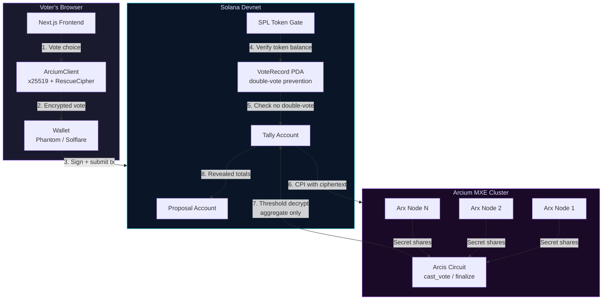

# Private DAO Voting

[](https://github.com/Ridwannurudeen/private-dao-voting/actions/workflows/ci.yml)

**Confidential governance on Solana, powered by Arcium's Multi-Party Computation.**

**[Live Demo](https://privatedao-arcium.vercel.app/)** | [GitHub](https://github.com/Ridwannurudeen/private-dao-voting)

Votes are encrypted client-side, tallied inside Arcium's MXE using the **Cerberus** protocol (dishonest majority security), and only the final aggregate result is published on-chain — with correctness proofs. No one (not validators, not the DAO authority, not other voters) can see how any individual voted.

---

## Demo

| Landing Page | Dashboard | Proposal Detail |
|:---:|:---:|:---:|
|  |  |  |
| Hero with "Vote Privately on Solana" and wallet connect | Governance dashboard with stats, proposals, and MXE status | On-chain details with encrypted vote casting |

> **Try it live:** [privatedao-arcium.vercel.app](https://privatedao-arcium.vercel.app/) — Connect a Solana devnet wallet to create proposals and cast encrypted votes.

---

## Features

- **Encrypted voting** — x25519 ECDH + RescueCipher encryption before votes leave your browser
- **MPC tallying** — Arcium MXE nodes compute on encrypted data; no single party sees votes
- **Token-gated access** — SPL token balance required to vote, with built-in faucet for devnet
- **Double-vote prevention** — On-chain VoteRecord PDA per (proposal, voter) pair
- **Time-locked voting** — Configurable voting period with real-time countdown
- **4-step vote progress** — Animated UX: Encrypting → Submitting → Processing → Confirmed
- **Proposal creation** — Create proposals with title, description, duration, and gate token config
- **Result reveal** — Authority reveals aggregate results after voting ends
- **Shareable proposals** — Direct links via `/proposal/[id]`
- **Export results** — Download results as CSV or JSON
- **Dark/light theme** — Toggle with localStorage persistence
- **Keyboard shortcuts** — `N` new proposal, `R` refresh, `Esc` close
- **Live activity feed** — On-chain event monitoring
- **Stats dashboard** — Participation metrics and proposal overview
- **Confetti celebration** — Animation on successful vote submission
- **Mobile-responsive** — Optimized for all screen sizes
- **PWA-installable** — Add to home screen via Web App Manifest

---

## Why Private Voting Matters

Public on-chain voting is broken:

| Problem | Impact |
|---------|--------|
| **Vote buying** | Buyers can verify how you voted and pay/punish accordingly |
| **Social coercion** | Whales and leaders influence others by voting first |
| **Front-running** | MEV bots and last-minute voters game the outcome |
| **Voter apathy** | People abstain rather than face backlash for unpopular positions |

Private DAO Voting eliminates all four. Your vote is encrypted the moment you click — the tally happens inside Arcium's encrypted shared state, and only the final result is ever revealed.

### Privacy Benefits Provided by Arcium

| Benefit | How Arcium Delivers It |
|---------|----------------------|
| **Vote secrecy** | Individual votes are encrypted with x25519 ECDH + RescueCipher before leaving the browser. The MXE processes votes as `Enc<Shared, u8>` secret shares — no single Arx Node ever sees a plaintext vote. |
| **Coercion resistance** | Since votes are never individually decryptable (not even by the DAO authority or Solana validators), no one can prove how you voted. Vote buying becomes economically irrational. |
| **Tally integrity** | Arcium's MXE produces cryptographic correctness proofs that the published aggregate (yes/no/abstain counts) is the mathematically valid sum of all encrypted inputs. |
| **Front-running prevention** | Encrypted tally state is opaque until `finalize_and_reveal` is called after the voting deadline. No one can see interim results and vote strategically. |
| **Threshold trust model** | Votes are split into secret shares across multiple independent Arx Nodes. Compromising a single node reveals nothing. |
| **Minimal on-chain footprint** | Only encrypted ciphertext is stored on Solana. Decryption and aggregation happen inside the MXE, so the blockchain never contains plaintext vote data. |

---

## How Arcium Makes This Possible

### The Privacy Flow

```
  Voter's Browser              Solana Program              Arcium MXE Cluster
  ================             ==============              ==================

  1. Choose YES/NO/ABSTAIN
         │
         ▼
  2. Encrypt with x25519
     + RescueCipher
     (vote → ciphertext)
         │
         ▼
  3. Submit encrypted    ────►  4. Verify token gate
     vote on-chain              Check double-vote PDA
                                Store ciphertext
                                         │
                                         ▼
                                5. CPI to Arcium  ────►  6. MPC nodes receive
                                   (queue computation)      encrypted vote shares
                                                                    │
                                                                    ▼
                                                            7. Homomorphic tally
                                                               (add encrypted
                                                                values without
                                                                decrypting them)
                                                                    │
                                         ┌──────────────────────────┘
                                         ▼
                                8. Callback with          9. Aggregate result
                                   revealed tally  ◄────     decrypted ONLY as
                                   (yes, no, abstain)        a final sum
                                         │
                                         ▼
                                10. Public result
                                    stored on Solana
                                    (individual votes
                                     remain secret forever)
```

### What Arcium's MXE Actually Does

The **MXE (Multi-Party Computation eXecution Environment)** is a cluster of independent nodes (Arx Nodes) that collectively compute on encrypted data:

1. **Secret Sharing** — Each encrypted vote is split into cryptographic shares distributed across nodes. No single node holds enough information to reconstruct any vote.

2. **Encrypted Computation** — The Arcis circuit (`cast_vote`) runs inside the MXE, performing arithmetic on `Enc<Mxe, Tally>` values. All additions happen on ciphertext — the nodes never see plaintext.

3. **Threshold Decryption (Cerberus)** — Only `finalize_and_reveal` triggers decryption via the Cerberus protocol, and only for aggregate totals. Individual votes are never reconstructed. Cerberus provides **dishonest majority** security — even if N-1 of N nodes are malicious, they cannot learn votes or forge the tally.

4. **Circuit Integrity** — The `circuit_hash!` macro embeds the SHA-256 hash of the compiled circuit at build time. During `init_comp_def`, this hash is verified against the deployed bytecode — if any node runs a modified circuit, the mismatch is detected.

5. **Correctness Proofs** — The MXE produces cryptographic proofs that the published result is the correct aggregation of all submitted votes, without revealing any individual vote.

### The Arcis Circuit

The core privacy logic lives in `arcis/voting-circuit/src/lib.rs`, using the `#[encrypted]` module pattern with `Enc<Mxe, Tally>` for cluster-owned state:

```rust
#[encrypted]
mod circuits {
    use arcis_imports::*;

    pub struct Tally { pub yes: u64, pub no: u64, pub abstain: u64, pub total: u64 }

    #[instruction]
    pub fn cast_vote(state: Enc<Mxe, Tally>, vote: Enc<Shared, u8>) -> Enc<Mxe, Tally> {
        let tally = state.to_arcis();

        // Constant-time encrypted comparisons — no branching on secrets
        let is_yes: Enc<Shared, u64> = vote.eq(&Enc::new(1u8)).cast();
        let is_no: Enc<Shared, u64> = vote.eq(&Enc::new(0u8)).cast();
        let is_abstain: Enc<Shared, u64> = vote.eq(&Enc::new(2u8)).cast();

        state.owner.from_arcis(Tally {
            yes: tally.yes + is_yes,
            no: tally.no + is_no,
            abstain: tally.abstain + is_abstain,
            total: tally.total + Enc::new(1u64),
        })
    }
}
```

Key design decisions:
- **Constant-time comparisons** — `eq()` + `cast()` avoids branching on secret values (MPC cannot branch on encrypted data)
- **No early reveal** — the circuit never calls `.reveal()` on individual votes or intermediate state
- **Three-way vote** — YES/NO/ABSTAIN support via encrypted boolean flags, not arithmetic that could underflow

---

## Architecture

```
private-dao-voting/
├── arcis/voting-circuit/          # Arcis MPC circuit (Rust)
│   └── src/lib.rs                 #   Tally struct, cast_vote, finalize_and_reveal
├── programs/private-dao-voting/   # Anchor/Solana program (Rust)
│   └── src/lib.rs                 #   On-chain logic, token gating, vote recording
├── tests/                         # Anchor integration tests
│   └── private-dao-voting.test.ts
├── frontend/
│   ├── pages/
│   │   ├── index.tsx              #   Dashboard with proposal listing and voting
│   │   ├── proposal/[id].tsx      #   Shareable proposal detail page
│   │   ├── _app.tsx               #   Wallet provider, theme, meta tags
│   │   └── api/faucet.ts          #   Rate-limited gate token faucet
│   ├── components/
│   │   ├── ProposalCard.tsx       #   Proposal display, voting UI, countdown
│   │   ├── CreateModal.tsx        #   Proposal creation form
│   │   ├── VoteProgress.tsx       #   4-step privacy processing animation
│   │   ├── EncryptionAnimation.tsx #  Particle animation during encryption
│   │   ├── Confetti.tsx           #   Celebration effect on vote success
│   │   ├── DashboardLayout.tsx    #   Main layout with sidebar
│   │   ├── Sidebar.tsx            #   Navigation sidebar with MXE status
│   │   ├── StatsBar.tsx           #   Participation stats dashboard
│   │   ├── ActivityFeed.tsx       #   On-chain event feed
│   │   ├── ExportResults.tsx      #   CSV/JSON result export
│   │   ├── NetworkVisualization.tsx #  Live network status display
│   │   ├── DeveloperConsole.tsx   #   MXE debug panel
│   │   ├── OnboardingDrawer.tsx   #   How It Works guide
│   │   ├── ThemeToggle.tsx        #   Dark/light mode toggle
│   │   ├── Toast.tsx              #   Notifications with Explorer links
│   │   └── Icons.tsx              #   SVG icon components
│   ├── hooks/
│   │   └── useKeyboardShortcuts.ts
│   ├── lib/
│   │   ├── arcium.ts              #   Arcium client (encryption, MXE integration)
│   │   ├── contract.ts            #   Solana program helpers (PDAs, instructions)
│   │   ├── errors.ts              #   Error parsing + Explorer URL helper
│   │   └── retry.ts               #   Exponential backoff for RPC calls
│   ├── idl/
│   │   └── private_dao_voting.json #  Program IDL (deployed)
│   └── public/
│       ├── favicon.svg
│       └── manifest.json          #   PWA manifest
├── scripts/                       # Devnet setup and testing
├── CONTRIBUTING.md
└── .github/workflows/ci.yml      # CI pipeline
```

### System Overview



---

## On-Chain Accounts

| Account | Type | Description |
|---------|------|-------------|
| **Proposal** | PDA `["proposal", id]` | Stores title, description, voting deadline, gate mint, vote counts, reveal status |
| **Tally** | PDA `["tally", proposal]` | Encrypted vote accumulator initialized per proposal |
| **VoteRecord** | PDA `["vote_record", proposal, voter]` | Prevents double voting; created on first vote |

### Proposal Fields

| Field | Type | Description |
|-------|------|-------------|
| `id` | `u64` | Unique proposal identifier |
| `authority` | `Pubkey` | Creator who can reveal results |
| `title` | `String` | Proposal title |
| `description` | `String` | Proposal description |
| `voting_ends_at` | `i64` | Unix timestamp when voting closes |
| `is_active` | `bool` | Whether the proposal accepts votes |
| `is_revealed` | `bool` | Whether results have been revealed |
| `total_votes` | `u32` | Number of votes cast |
| `gate_mint` | `Pubkey` | SPL token required to vote |
| `min_balance` | `u64` | Minimum token balance to vote |
| `yes_votes` | `u32` | Yes count (populated after reveal) |
| `no_votes` | `u32` | No count (populated after reveal) |
| `abstain_votes` | `u32` | Abstain count (populated after reveal) |

---

## Security Model

| Layer | Mechanism | What it prevents |
|-------|-----------|-----------------|
| **Vote privacy** | x25519 ECDH + RescueCipher encryption | Anyone reading vote content |
| **Double voting** | `VoteRecord` PDA per (proposal, voter) | Same wallet voting twice |
| **Token gating** | SPL token balance check before vote | Non-stakeholders influencing outcomes |
| **Callback auth** | Sign PDA signer constraint on callbacks | Unauthorized result injection |
| **Time lock** | `voting_ends_at` timestamp enforcement | Votes after deadline |
| **MPC integrity (Cerberus)** | Dishonest majority MPC — MAC-authenticated secret shares across Arx Nodes | Even N-1 malicious nodes cannot learn votes or forge tallies |
| **Circuit integrity** | `circuit_hash!` macro embeds SHA-256 of compiled circuit at build time | Tampered MPC bytecode detected at `init_comp_def` |

---

## Getting Started

### Prerequisites

- [Rust](https://rustup.rs/) + [Solana CLI](https://docs.solanalabs.com/cli/install) (v1.18+)
- [Anchor](https://www.anchor-lang.com/docs/installation) v0.32.1
- [Node.js](https://nodejs.org/) v18+
- A Solana wallet (Phantom, Solflare, etc.)

### Build & Deploy

```bash
# Clone the repository
git clone https://github.com/Ridwannurudeen/private-dao-voting.git
cd private-dao-voting

# Build the Anchor program
anchor build

# Deploy to Solana devnet
solana config set --url devnet
anchor deploy --provider.cluster devnet
```

### Run the Frontend

```bash
cd frontend
npm install

# Create .env.local with required environment variables
cat > .env.local << EOF
NEXT_PUBLIC_SOLANA_RPC=https://api.devnet.solana.com
NEXT_PUBLIC_GATE_MINT=<your-gate-mint-pubkey>
GATE_MINT_AUTHORITY=<base64-encoded-mint-authority-keypair>
NEXT_PUBLIC_MXE_PROGRAM_ID=
EOF

npm run dev
# Open http://localhost:3000
```

### Environment Variables

| Variable | Required | Description |
|----------|----------|-------------|
| `NEXT_PUBLIC_SOLANA_RPC` | Yes | Solana RPC endpoint (e.g., `https://api.devnet.solana.com`) |
| `NEXT_PUBLIC_GATE_MINT` | Yes | SPL token mint address used for vote gating |
| `GATE_MINT_AUTHORITY` | Yes | Base64-encoded JSON array of the mint authority keypair (used by faucet) |
| `NEXT_PUBLIC_MXE_PROGRAM_ID` | No | Arcium MXE program ID. Leave empty for dev mode |

### Gate Token Faucet

The frontend includes a built-in faucet (`/api/faucet`) that mints gate tokens to any wallet for devnet testing:

- **Rate limited**: Max 3 claims per wallet per 10 minutes
- **Mints 10 tokens** per claim to the requesting wallet
- **Auto-creates** the Associated Token Account if it doesn't exist
- The faucet uses the `GATE_MINT_AUTHORITY` keypair to sign mint transactions

### Run Tests

```bash
# Anchor integration tests
anchor test --skip-local-validator

# Playwright E2E tests (frontend)
cd frontend
npx playwright install --with-deps chromium
npx playwright test

# Arcis circuit unit tests
cd arcis/voting-circuit
cargo test
```

---

## Development Mode

The app includes a **dev mode** that runs when `NEXT_PUBLIC_MXE_PROGRAM_ID` is not set. In dev mode:

- Votes are encrypted locally using the same x25519 + RescueCipher pipeline
- The `dev_cast_vote` instruction bypasses Arcium CPI but still enforces token gating and double-vote prevention
- Vote tallies are tracked client-side and submitted via `dev_reveal_results`
- All security checks (token balance, time locks, PDA constraints) remain active

This allows full end-to-end testing without a live MXE cluster. Set `NEXT_PUBLIC_MXE_PROGRAM_ID` to your deployed MXE program ID for production mode.

### Program Instructions

| Instruction | Description | Access |
|-------------|-------------|--------|
| `dev_create_proposal` | Create a new proposal with voting period and gate token | Any wallet |
| `dev_init_tally` | Initialize the tally account for a proposal | Proposal authority |
| `dev_cast_vote` | Submit an encrypted vote (dev mode) | Token holders |
| `dev_reveal_results` | Reveal aggregate results after voting ends | Proposal authority |
| `cast_vote` | Submit encrypted vote with Arcium CPI (production) | Token holders |

---

## Deployed Program

- **Program ID**: `71tbXM3A2j5pKHfjtu1LYgY8jfQWuoZtHecDu6F6EPJH`
- **Network**: Solana Devnet
- **Gate Token Mint**: `6JeDjgobNYjSzuUUyEaiNnzphBDgVYcwf3u9HLNtPu17`

---

## Tech Stack

| Component | Technology | Version |
|-----------|-----------|---------|
| Smart contract | Anchor (Solana) | 0.32.1 |
| MPC circuit | Arcis (Arcium) | 0.1.0 |
| Arcium client | @arcium-hq/client | 0.7.0 |
| Frontend | Next.js + React | 14.2.35 |
| Styling | Tailwind CSS | 3.4.0 |
| E2E testing | Playwright | latest |
| Wallet | Solana Wallet Adapter | latest |
| Token standard | SPL Token | 0.4.x |

---

## License

MIT
