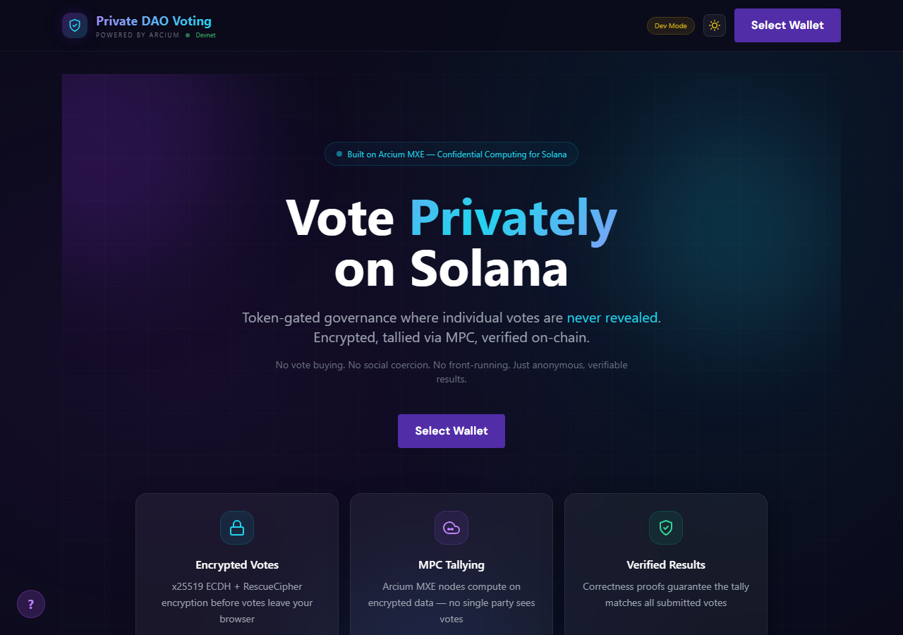
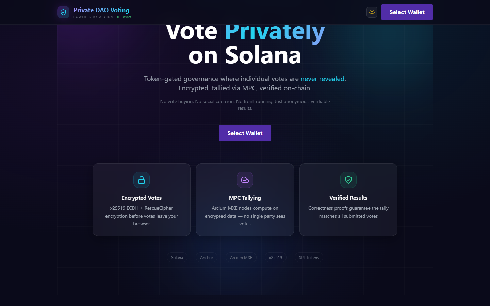
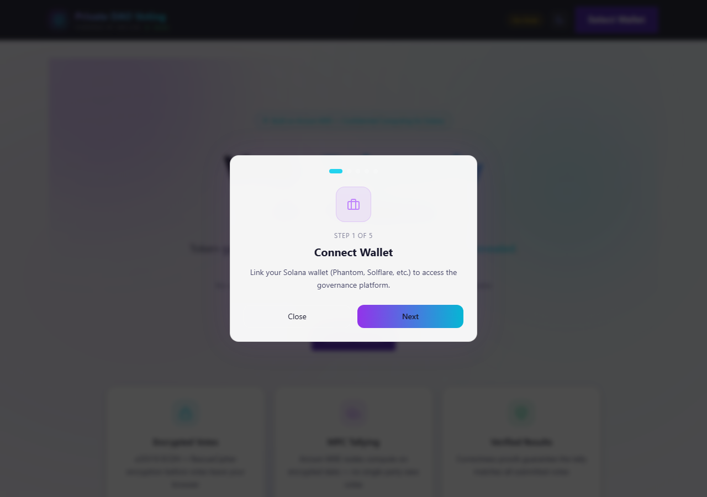

# Private DAO Voting

**Fully confidential on-chain governance for Solana, powered by [Arcium](https://arcium.com) MXE.**

**[Live on Devnet](https://privatedao-arcium.vercel.app/)** | [Demo Video](https://www.loom.com/share/b7599bd310024a6cbef18e3b7fa0f70b) | [Explorer](https://explorer.solana.com/address/71tbXM3A2j5pKHfjtu1LYgY8jfQWuoZtHecDu6F6EPJH?cluster=devnet)

> Votes are encrypted client-side with x25519 + RescueCipher, submitted as ciphertext to Solana, tallied inside Arcium's MXE via the **Cerberus** protocol (dishonest-majority MPC), and only the aggregate result is ever revealed on-chain — with correctness proofs. No validator, no DAO authority, no other voter can see how anyone voted.

---

## Demo

[](https://www.loom.com/share/b7599bd310024a6cbef18e3b7fa0f70b)

| Landing | Features | Onboarding |
|:---:|:---:|:---:|
|  |  |  |

**[Try it live](https://privatedao-arcium.vercel.app/)** — Connect a Solana devnet wallet, claim gate tokens, create proposals, and cast encrypted votes.

---

## How It Works

```
  Voter's Browser              Solana Program              Arcium MXE (Cluster 456)
  ================             ==============              ========================

  1. Choose YES/NO/ABSTAIN
         |
         v
  2. x25519 ECDH key exchange
     with MXE public key
         |
         v
  3. RescueCipher encrypt
     (vote -> ciphertext)
         |
         v
  4. Sign & submit tx  ----->  5. Verify SPL token gate
                                  Check VoteRecord PDA
                                  Store ciphertext on-chain
                                           |
                                           v
                                6. CPI to Arcium MXE  ----->  7. Secret-share across
                                   (queue computation)           Arx Nodes (Cerberus)
                                                                        |
                                                                        v
                                                               8. Encrypted tally
                                                                  (add ciphertexts
                                                                   without decrypting)
                                                                        |
                                           <----------------------------+
                                           v
                                9. Callback writes           10. Threshold decrypt
                                   revealed aggregate  <----     aggregate ONLY
                                   (yes, no, abstain)
                                           |
                                           v
                                11. Final result on Solana
                                    (individual votes stay
                                     secret forever)
```

### Why This Matters

Public on-chain voting is broken:

| Problem | Impact |
|---------|--------|
| **Vote buying** | Buyers verify how you voted and pay or punish accordingly |
| **Social coercion** | Whales vote first and pressure others to follow |
| **Front-running** | MEV bots and last-minute voters game the outcome |
| **Voter apathy** | People abstain rather than face backlash for unpopular positions |

Private DAO Voting eliminates all four. Your vote is encrypted the moment you click — the tally runs inside Arcium's encrypted shared state, and only the final result is ever revealed.

---

## Arcium Integration

### MXE Configuration

| Parameter | Value |
|-----------|-------|
| **Cluster** | 456 (Solana Devnet, v0.8.5) |
| **MXE Program** | `Arcj82pX7HxYKLR92qvgZUAd7vGS1k4hQvAFcPATFdEQ` |
| **Protocol** | Cerberus (dishonest-majority) |
| **Security** | N-1 of N nodes can be malicious; correct & private if at least 1 is honest |
| **Encryption** | x25519 ECDH + RescueCipher (field-element encryption over Rescue hash) |

### What the MXE Does

1. **Secret Sharing** — Each encrypted vote is split into cryptographic shares distributed across independent Arx Nodes. No single node holds enough information to reconstruct any vote.

2. **Encrypted Computation** — The Arcis circuit (`cast_vote`) runs inside the MXE, performing arithmetic on `Enc<Mxe, Tally>` values. All additions happen on ciphertext — the nodes never see plaintext.

3. **Cerberus Protocol** — Provides dishonest-majority security with MAC-authenticated secret shares. Even if N-1 of N nodes collude, they cannot learn individual votes or forge the tally. Tampering is detected immediately.

4. **Threshold Decryption** — Only `finalize_and_reveal` triggers decryption, and only for aggregate totals. Individual votes are never reconstructed.

5. **Circuit Integrity** — `circuit_hash!` embeds the SHA-256 of compiled circuit bytecode at build time. If any node runs a modified circuit, the mismatch is detected at `init_comp_def`.

6. **Correctness Proofs** — The MXE produces cryptographic proofs that the published result is the correct aggregation of all submitted votes.

### The Arcis Circuit

Core privacy logic in `arcis/voting-circuit/src/lib.rs`:

```rust
#[encrypted]
mod circuits {
    use arcis_imports::*;

    pub struct Tally { pub yes: u64, pub no: u64, pub abstain: u64, pub total: u64 }

    #[instruction]
    pub fn cast_vote(state: Enc<Mxe, Tally>, vote: Enc<Shared, u8>) -> Enc<Mxe, Tally> {
        let tally = state.to_arcis();

        // Constant-time encrypted comparisons — no branching on secrets
        let is_yes: Enc<Shared, u64> = vote.eq(&Enc::new(1u8)).cast();
        let is_no: Enc<Shared, u64> = vote.eq(&Enc::new(0u8)).cast();
        let is_abstain: Enc<Shared, u64> = vote.eq(&Enc::new(2u8)).cast();

        state.owner.from_arcis(Tally {
            yes: tally.yes + is_yes,
            no: tally.no + is_no,
            abstain: tally.abstain + is_abstain,
            total: tally.total + Enc::new(1u64),
        })
    }
}
```

Design decisions:
- **Constant-time comparisons** — `eq()` + `cast()` avoids branching on secret values (MPC cannot branch on encrypted data)
- **No early reveal** — the circuit never calls `.reveal()` on individual votes or intermediate state
- **Three-way vote** — YES/NO/ABSTAIN via encrypted boolean flags, not arithmetic that could underflow

### Privacy Guarantees

| Guarantee | How Arcium Delivers It |
|-----------|----------------------|
| **Vote secrecy** | Votes are encrypted with x25519 ECDH + RescueCipher before leaving the browser. The MXE processes them as `Enc<Shared, u8>` secret shares — no single node ever sees a plaintext vote. |
| **Coercion resistance** | Votes are never individually decryptable (not even by the DAO authority or validators). Vote buying becomes economically irrational. |
| **Tally integrity** | Cryptographic correctness proofs guarantee the published aggregate is the mathematically valid sum of all encrypted inputs. |
| **Front-running prevention** | Encrypted tally state is opaque until `finalize_and_reveal`. No one can see interim results and vote strategically. |
| **Threshold trust** | Cerberus — compromising a single Arx Node reveals nothing. Security holds as long as at least 1 of N nodes is honest. |
| **Minimal footprint** | Only ciphertext is stored on Solana. Decryption and aggregation happen inside the MXE. The blockchain never contains plaintext vote data. |

---

## Features

- **End-to-end encrypted voting** — x25519 ECDH key exchange with MXE + RescueCipher encryption
- **MPC tallying via Arcium** — Cluster 456 Arx Nodes compute on encrypted data
- **Token-gated access** — SPL token balance required to vote, with built-in faucet
- **Double-vote prevention** — On-chain VoteRecord PDA per (proposal, voter) pair
- **Auto tally initialization** — Tally accounts are auto-created if missing when voting
- **Time-locked voting** — Configurable voting period with real-time countdown
- **4-step vote progress** — Encrypting → Submitting → Processing → Confirmed
- **Graceful MXE fallback** — Local encryption when MXE cluster is bootstrapping
- **Proposal creation** — Title, description, duration, and gate token configuration
- **Result reveal** — Authority reveals aggregate results after voting ends
- **Shareable proposals** — Direct links via `/proposal/[id]`
- **Export results** — Download as CSV or JSON
- **Dark/light theme** — Toggle with localStorage persistence
- **Keyboard shortcuts** — `N` new proposal, `R` refresh, `Esc` close
- **Live activity feed** — On-chain event monitoring
- **Stats dashboard** — Participation metrics and proposal overview
- **MXE status monitor** — Real-time cluster status in sidebar (Active / Awaiting MXE / Offline)
- **Developer console** — MXE debug panel with cluster info, circuit details, and protocol stats
- **Mobile-responsive** — Optimized for all screen sizes
- **PWA-installable** — Add to home screen via Web App Manifest

---

## Architecture

```
private-dao-voting/
├── arcis/voting-circuit/          # Arcis MPC circuit (Rust)
│   └── src/lib.rs                 #   Tally struct, cast_vote, finalize_and_reveal
├── programs/private-dao-voting/   # Anchor/Solana program (Rust)
│   └── src/lib.rs                 #   On-chain logic, token gating, Arcium CPI
├── frontend/
│   ├── pages/
│   │   ├── index.tsx              #   Dashboard with proposals and voting
│   │   ├── proposal/[id].tsx      #   Shareable proposal detail page
│   │   └── api/faucet.ts          #   Rate-limited gate token faucet
│   ├── components/
│   │   ├── ProposalCard.tsx       #   Proposal display, voting UI, countdown
│   │   ├── VoteProgress.tsx       #   4-step privacy processing animation
│   │   ├── Sidebar.tsx            #   Navigation + MXE heartbeat monitor
│   │   ├── DeveloperConsole.tsx   #   MXE debug panel
│   │   ├── NetworkVisualization.tsx #  Live Arx Node status
│   │   └── ...                    #   20+ components
│   └── lib/
│       ├── arcium.ts              #   ArciumClient — encryption, MXE key exchange, fallback
│       ├── contract.ts            #   Solana program helpers (PDAs, instructions, tally init)
│       ├── errors.ts              #   Anchor error parsing with log extraction
│       └── retry.ts               #   Exponential backoff for RPC calls
├── tests/
│   └── private-dao-voting.test.ts
└── .github/workflows/ci.yml
```

### System Overview


---

## On-Chain Accounts

| Account | PDA Seeds | Description |
|---------|-----------|-------------|
| **Proposal** | `["proposal", id (u64 LE)]` | Title, description, voting deadline, gate mint, vote counts, reveal status |
| **Tally** | `["tally", proposal]` | Encrypted vote accumulator — initialized per proposal, auto-created if missing |
| **VoteRecord** | `["vote_record", proposal, voter]` | Prevents double voting; created on first vote |
| **ComputationOffsetState** | `["computation_offset"]` | Tracks MXE computation offsets for Arcium CPI |

### Program Instructions

| Instruction | Mode | Description | Access |
|-------------|------|-------------|--------|
| `cast_vote` | Production | Submit encrypted vote with full Arcium MXE CPI | Token holders |
| `vote_callback` | Production | MXE callback after encrypted tally update | Arcium (sign PDA) |
| `reveal_results` | Production | Trigger threshold decryption of aggregate | Authority |
| `reveal_results_callback` | Production | MXE callback with decrypted totals | Arcium (sign PDA) |
| `init_comp_def` | Production | Register Arcis circuit with hash verification | Authority |
| `dev_create_proposal` | Dev/Fallback | Create a new proposal with voting period and gate token | Any wallet |
| `dev_init_tally` | Dev/Fallback | Initialize the tally account for a proposal | Any wallet (payer) |
| `dev_cast_vote` | Dev/Fallback | Submit encrypted vote without Arcium CPI | Token holders |
| `dev_reveal_results` | Dev/Fallback | Reveal results with client-provided tallies | Authority |

---

## Security Model

| Layer | Mechanism | What It Prevents |
|-------|-----------|-----------------|
| **Vote privacy** | x25519 ECDH + RescueCipher | Anyone reading vote content |
| **MPC integrity** | Cerberus (dishonest majority, MAC-authenticated shares) | N-1 malicious nodes learning votes or forging tallies |
| **Circuit integrity** | `circuit_hash!` SHA-256 verification at `init_comp_def` | Tampered MPC bytecode |
| **Double voting** | `VoteRecord` PDA per (proposal, voter) | Same wallet voting twice |
| **Token gating** | SPL token balance check before vote | Non-stakeholders influencing outcomes |
| **Callback auth** | Sign PDA signer constraint on MXE callbacks | Unauthorized result injection |
| **Time lock** | `voting_ends_at` timestamp enforcement | Votes after deadline |
| **Front-running** | Encrypted tally opaque until `finalize_and_reveal` | Strategic last-minute voting |

---

## Getting Started

### Prerequisites

- [Rust](https://rustup.rs/) + [Solana CLI](https://docs.solanalabs.com/cli/install) (v1.18+)
- [Anchor](https://www.anchor-lang.com/docs/installation) v0.32.1
- [Node.js](https://nodejs.org/) v18+
- A Solana wallet (Phantom, Solflare, etc.)

### Build & Deploy

```bash
git clone https://github.com/Ridwannurudeen/private-dao-voting.git
cd private-dao-voting

# Build the Anchor program
anchor build

# Deploy to Solana devnet
solana config set --url devnet
anchor deploy --provider.cluster devnet
```

### Run the Frontend

```bash
cd frontend
npm install

# Create .env.local
cat > .env.local << 'EOF'
NEXT_PUBLIC_SOLANA_RPC=https://api.devnet.solana.com
NEXT_PUBLIC_GATE_MINT=6JeDjgobNYjSzuUUyEaiNnzphBDgVYcwf3u9HLNtPu17
NEXT_PUBLIC_MXE_PROGRAM_ID=Arcj82pX7HxYKLR92qvgZUAd7vGS1k4hQvAFcPATFdEQ
GATE_MINT_AUTHORITY=<base64-encoded-mint-authority-keypair>
EOF

npm run dev
# Open http://localhost:3000
```

### Environment Variables

| Variable | Required | Description |
|----------|----------|-------------|
| `NEXT_PUBLIC_SOLANA_RPC` | Yes | Solana RPC endpoint |
| `NEXT_PUBLIC_GATE_MINT` | Yes | SPL token mint for vote gating |
| `NEXT_PUBLIC_MXE_PROGRAM_ID` | No | Arcium MXE program ID. Leave empty for dev mode. Set to `Arcj82pX7HxYKLR92qvgZUAd7vGS1k4hQvAFcPATFdEQ` for Cluster 456. |
| `GATE_MINT_AUTHORITY` | Yes | Base64-encoded mint authority keypair (used by faucet) |

### Gate Token Faucet

The frontend includes a built-in faucet (`/api/faucet`) for devnet testing:

- **Rate limited**: Max 3 claims per wallet per 10 minutes
- **Mints 10 tokens** per claim
- **Auto-creates** the Associated Token Account if needed
- Uses the `GATE_MINT_AUTHORITY` keypair to sign mint transactions

### Run Tests

```bash
# Anchor integration tests
anchor test --skip-local-validator

# Arcis circuit unit tests
cd arcis/voting-circuit
cargo test
```

---

## Deployment

| Component | Location |
|-----------|----------|
| **Solana Program** | [`71tbXM3A2j5pKHfjtu1LYgY8jfQWuoZtHecDu6F6EPJH`](https://explorer.solana.com/address/71tbXM3A2j5pKHfjtu1LYgY8jfQWuoZtHecDu6F6EPJH?cluster=devnet) (Devnet) |
| **Arcium MXE** | Cluster 456 (v0.8.5, Devnet) |
| **MXE Program** | `Arcj82pX7HxYKLR92qvgZUAd7vGS1k4hQvAFcPATFdEQ` |
| **Gate Token Mint** | [`6JeDjgobNYjSzuUUyEaiNnzphBDgVYcwf3u9HLNtPu17`](https://explorer.solana.com/address/6JeDjgobNYjSzuUUyEaiNnzphBDgVYcwf3u9HLNtPu17?cluster=devnet) |
| **Frontend** | [privatedao-arcium.vercel.app](https://privatedao-arcium.vercel.app/) |

---

## Tech Stack

| Component | Technology | Version |
|-----------|-----------|---------|
| Smart contract | Anchor (Solana) | 0.32.x |
| MPC circuit | Arcis (Arcium) | 0.1.0 |
| Arcium client | @arcium-hq/client | 0.7.0 |
| Frontend | Next.js + React | 14.2.x |
| Styling | Tailwind CSS | 3.4.x |
| Wallet | Solana Wallet Adapter | latest |
| Token standard | SPL Token | 0.4.x |

---

## License

MIT
