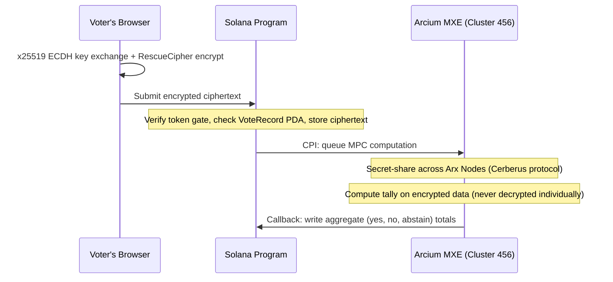
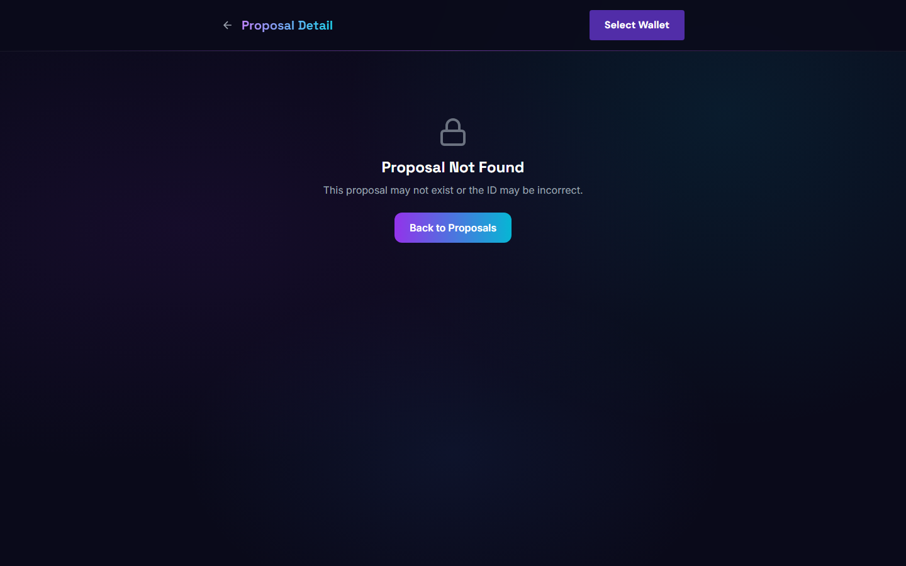

<div align="center">

# Private DAO Voting

### Fully confidential on-chain governance for Solana

[](https://github.com/Ridwannurudeen/private-dao-voting/actions)
[](https://privatedao-arcium.vercel.app/)
[](https://explorer.solana.com/address/71tbXM3A2j5pKHfjtu1LYgY8jfQWuoZtHecDu6F6EPJH?cluster=devnet)
[](https://arcium.com)
[](LICENSE)

<br />

<a href="https://privatedao-arcium.vercel.app/">
  
</a>

<br />

Votes are encrypted in your browser, tallied by MPC nodes, and only the aggregate is revealed on-chain.
<br />
No validator, no authority, no other voter can see how you voted.

<br />

[Try the Demo](https://privatedao-arcium.vercel.app/) &nbsp;&middot;&nbsp; [Demo Video](https://www.loom.com/share/b7599bd310024a6cbef18e3b7fa0f70b) &nbsp;&middot;&nbsp; [Solana Explorer](https://explorer.solana.com/address/71tbXM3A2j5pKHfjtu1LYgY8jfQWuoZtHecDu6F6EPJH?cluster=devnet)

</div>

<br />

## The Problem

On-chain governance votes are public. This enables **vote buying**, **social coercion**, **strategic last-minute voting**, and **front-running** by MEV bots. Early results create bandwagon effects. Private DAO Voting fixes this by encrypting every vote client-side and only revealing the aggregate after voting ends.

---

## How It Works


```mermaid
sequenceDiagram
    participant V as Voter's Browser
    participant S as Solana Program
    participant M as Arcium MXE (Cluster 456)

    V->>V: x25519 ECDH key exchange + RescueCipher encrypt
    V->>S: Submit encrypted ciphertext
    Note over S: Verify token gate, check VoteRecord PDA, store ciphertext
    S->>M: CPI: queue MPC computation
    Note over M: Secret-share across Arx Nodes (Cerberus protocol)
    Note over M: Compute tally on encrypted data (never decrypted individually)
    M->>S: Callback: write aggregate (yes, no, abstain) totals
```

Individual votes are _never_ decrypted. The MPC nodes compute the sum on encrypted values, and only the final aggregate is threshold-decrypted and written on-chain.

---

## Features

**Privacy** -- x25519 ECDH + RescueCipher encryption before votes leave your browser. MPC tallying via Arcium's Cerberus protocol (dishonest-majority, MAC-authenticated shares). SHA-256 circuit integrity verification at build time via `build.rs`.

**Governance** -- Token-gated proposals with configurable SPL balance requirements. Vote delegation with `cast_delegated_vote` and on-chain revocation. DAO-governed proposal creation via `community_create_proposal`. Quorum and threshold settings (basis points). Time-locked voting with live countdown. Permissionless reveal after deadline.

**Admin & Safety** -- `ProgramConfig` PDA with freeze/unfreeze for emergency halts. Authority transfer (multisig-ready). Cancel proposals with zero votes. Input validation (title, description, discussion URL lengths). Comprehensive [security audit checklist](SECURITY.md).

**Resilience** -- Offline vote queue with localStorage persistence and exponential backoff retry. MXE reconnection with automatic queue drain. Checked arithmetic throughout (no overflow).

**UX** -- 4-step vote progress animation. Dark/light theme with persistence. Shareable proposal links with read-only access. CSV/JSON export (with CSV injection protection). Live activity feed. Stats dashboard. MXE status monitor. Developer debug console (`D` key). 5-step onboarding walkthrough. Mobile-responsive. PWA-installable. Keyboard shortcuts (`N` new, `R` refresh, `Esc` close, `D` devtools).

---

## Screenshots

<table>
  <tr>
    <td align="center"><strong>Dark Mode</strong></td>
    <td align="center"><strong>Light Mode</strong></td>
  </tr>
  <tr>
    <td></td>
    <td></td>
  </tr>
  <tr>
    <td align="center"><strong>Mobile</strong></td>
    <td align="center"><strong>Proposal Detail</strong></td>
  </tr>
  <tr>
    <td align="center"></td>
    <td></td>
  </tr>
</table>

---

## Tech Stack

| Layer | Technology |
|-------|-----------|
| Smart Contract | [Anchor](https://www.anchor-lang.com/) 0.32.1 on [Solana](https://solana.com/) (2200+ lines) |
| MPC Circuit | [Arcis](https://docs.arcium.com/) 0.1.0 + [Arcium MXE](https://arcium.com) |
| Frontend | [Next.js](https://nextjs.org/) 14 + [React](https://react.dev/) 18 + [Tailwind CSS](https://tailwindcss.com/) 3.4 |
| Wallet | [Solana Wallet Adapter](https://github.com/anza-xyz/wallet-adapter) (Phantom, Solflare, Backpack) |
| Testing | [Vitest](https://vitest.dev/) (135 unit) + [Playwright](https://playwright.dev/) (49 E2E) |
| CI/CD | GitHub Actions + [Vercel](https://vercel.com/) |

---

## Quick Start

```bash
# Clone
git clone https://github.com/Ridwannurudeen/private-dao-voting.git
cd private-dao-voting

# Build & deploy the Solana program
anchor build -- --features dev-mode
solana config set --url devnet
solana airdrop 5
solana program deploy target/deploy/private_dao_voting.so \
  --program-id 71tbXM3A2j5pKHfjtu1LYgY8jfQWuoZtHecDu6F6EPJH \
  --with-compute-unit-price 500000 --use-rpc

# Run the frontend
cd frontend
npm install
cp .env.example .env.local    # edit with your values
npm run dev                    # http://localhost:3000
```

Connect your wallet and click **"Get Test Tokens"** to receive governance tokens from the devnet faucet.

---

## Architecture

```
private-dao-voting/
├── arcis/voting-circuit/          # MPC circuit (Rust) -- tally logic
├── programs/private-dao-voting/   # Anchor program (2200+ lines)
│   ├── src/lib.rs                 #   Proposals, voting, delegation, freeze, Arcium CPI
│   └── build.rs                   #   SHA-256 circuit hash computation at compile time
├── frontend/
│   ├── pages/                     # index.tsx, proposal/[id].tsx, api/faucet.ts
│   ├── components/                # 22 components (ProposalCard, VoteProgress, etc.)
│   ├── hooks/                     # useKeyboardShortcuts.ts
│   ├── lib/                       # arcium.ts, contract.ts, errors.ts, retry.ts, vote-queue.ts
│   └── e2e/                       # Playwright E2E tests (49 tests)
├── tests/                         # Anchor integration tests
├── SECURITY.md                    # Security audit checklist & mainnet deployment guide
└── .github/workflows/ci.yml      # Build, test, audit pipeline
```

### On-Chain PDAs

| Account | Seeds | Purpose |
|---------|-------|---------|
| `proposal` | `["proposal", id]` | Proposal metadata, timestamps, gate config |
| `tally` | `["tally", proposal]` | Encrypted vote accumulator |
| `vote_record` | `["vote_record", proposal, voter]` | Double-vote prevention |
| `delegation` | `["delegation", delegator]` | Vote delegation mapping |
| `program_config` | `["program_config"]` | Freeze/unfreeze state, authority management |
| `dao_config` | `["dao_config"]` | Community governance settings (min balance, mint) |
| `computation_offset` | `["computation_offset"]` | MXE computation counter |

---

## Security

| Threat | Mitigation |
|--------|-----------|
| Vote content exposure | x25519 ECDH + RescueCipher encryption |
| Malicious MPC nodes | Cerberus protocol (N-1 dishonest majority tolerance, MAC-authenticated shares) |
| Tampered MPC bytecode | SHA-256 circuit hash verified at build time via `build.rs` |
| Double voting | VoteRecord PDA per (proposal, voter) pair |
| Non-stakeholder voting | SPL token balance check at vote time |
| Unauthorized result injection | Sign PDA signer constraint on MXE callbacks |
| Post-deadline votes | `voting_ends_at` on-chain timestamp enforcement |
| Low-turnout manipulation | Configurable quorum + YES threshold (basis points) |
| Strategic last-minute voting | Encrypted tally opaque until `finalize_and_reveal` |
| Unauthorized delegation | On-chain delegate/revoke with deterministic PDA validation |
| Self-delegation | Explicit `delegator != delegate` check |
| Vote tally arithmetic errors | Checked arithmetic throughout + `total_votes == yes + no + abstain` assertion |
| Emergency exploit response | `freeze_program` / `unfreeze_program` with authority-only access |
| CSV injection in exports | Formula character sanitization in CSV output |
| XSS / content injection | Content-Security-Policy headers, `rehype-sanitize` for markdown |
| CSRF on faucet API | Exact origin validation, IP + wallet rate limiting |
| Input overflow | Title (100), description (5000), discussion URL (256) length validation |

See [SECURITY.md](SECURITY.md) for the full audit checklist and responsible disclosure policy.

---

## Environment Variables

| Variable | Required | Description |
|----------|----------|-------------|
| `NEXT_PUBLIC_SOLANA_RPC` | Yes | Solana JSON-RPC endpoint |
| `NEXT_PUBLIC_GATE_MINT` | No | SPL token mint for gating (default: devnet mint) |
| `NEXT_PUBLIC_MXE_PROGRAM_ID` | No | Arcium MXE program. Empty = dev mode. |
| `NEXT_PUBLIC_CLUSTER_OFFSET` | No | MXE cluster offset (default: `456`) |
| `NEXT_PUBLIC_NETWORK` | No | `devnet` or `mainnet` (default: `devnet`) |
| `GATE_MINT_AUTHORITY` | Yes | Base64 keypair for faucet mint authority |

---

## Deployment

| Component | Address |
|-----------|---------|
| Solana Program | [`71tbXM3A...EPJH`](https://explorer.solana.com/address/71tbXM3A2j5pKHfjtu1LYgY8jfQWuoZtHecDu6F6EPJH?cluster=devnet) (Devnet) |
| Arcium MXE | Cluster 456 (v0.8.5) |
| Gate Token | [`6JeDjgob...Pu17`](https://explorer.solana.com/address/6JeDjgobNYjSzuUUyEaiNnzphBDgVYcwf3u9HLNtPu17?cluster=devnet) |
| Frontend | [privatedao-arcium.vercel.app](https://privatedao-arcium.vercel.app/) |

---

## Testing

```bash
cd frontend
npm test                          # Vitest unit tests (135)
npx playwright test               # E2E browser tests (49)

# Anchor integration tests
cd .. && anchor test --skip-local-validator

# MPC circuit tests
cd arcis/voting-circuit && cargo test
```

CI runs on every push: build, typecheck, unit tests, E2E (with failure screenshots), security audit, and `rustfmt` check.

---

## Contributing

1. Fork the repo
2. Create a feature branch (`git checkout -b feat/my-feature`)
3. Write tests, ensure CI passes
4. Open a Pull Request

---

## License

MIT -- see [LICENSE](LICENSE).

<div align="center">
  <br />
  <sub>No vote buying. No social coercion. No front-running. Just anonymous, verifiable results.</sub>
</div>
