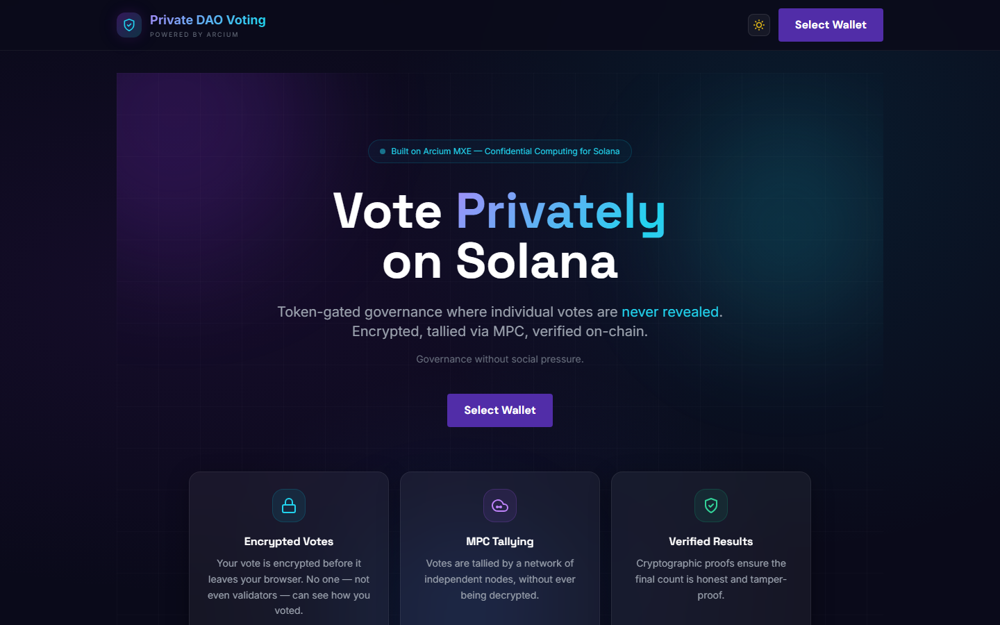
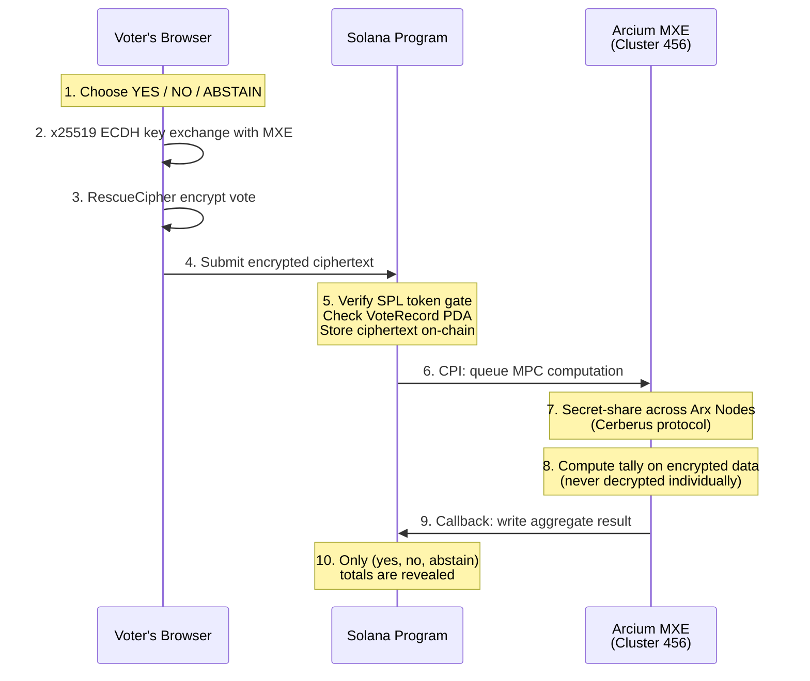
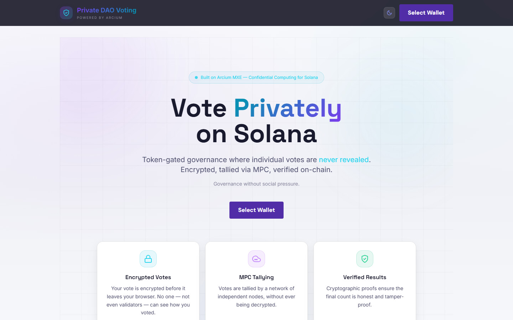
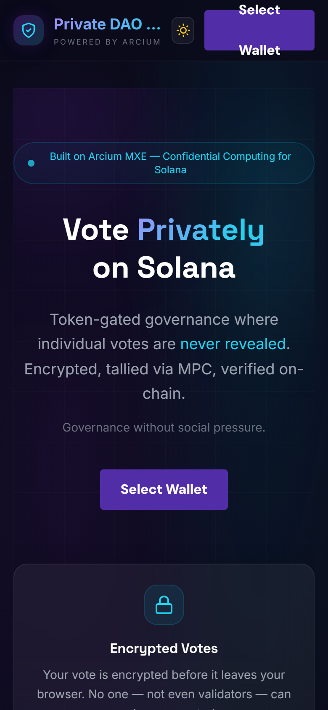
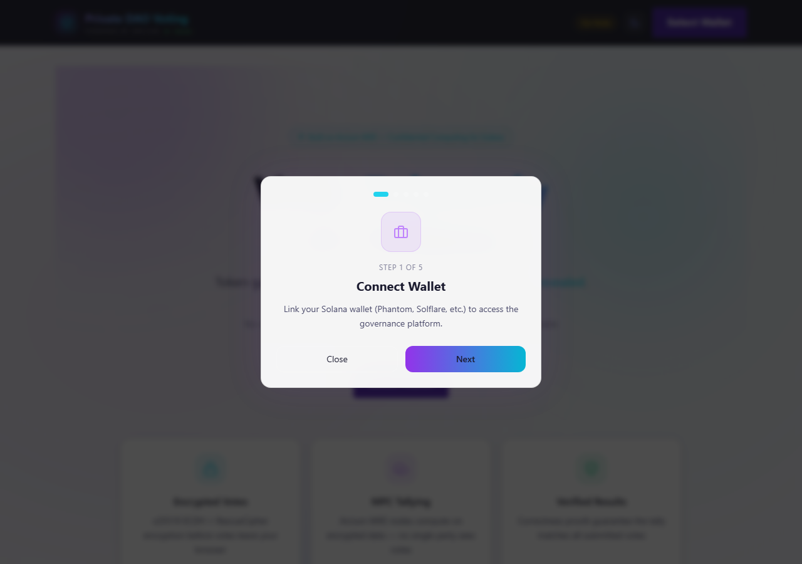

<div align="center">

# Private DAO Voting

### Fully confidential on-chain governance for Solana

[](https://github.com/Ridwannurudeen/private-dao-voting/actions)
[](https://privatedao-arcium.vercel.app/)
[](https://explorer.solana.com/address/71tbXM3A2j5pKHfjtu1LYgY8jfQWuoZtHecDu6F6EPJH?cluster=devnet)
[](https://arcium.com)
[](LICENSE)

<br />

<a href="https://privatedao-arcium.vercel.app/">
  
</a>

<br />

**Votes are encrypted in your browser, tallied by MPC nodes, and only the aggregate result is ever revealed on-chain.**
<br />
No validator, no DAO authority, no other voter can see how anyone voted.

<br />

[Try the Live Demo](https://privatedao-arcium.vercel.app/) &nbsp;&middot;&nbsp; [Watch Demo Video](https://www.loom.com/share/b7599bd310024a6cbef18e3b7fa0f70b) &nbsp;&middot;&nbsp; [View on Explorer](https://explorer.solana.com/address/71tbXM3A2j5pKHfjtu1LYgY8jfQWuoZtHecDu6F6EPJH?cluster=devnet)

</div>

---

## Table of Contents

- [Why Private Voting?](#why-private-voting)
- [How It Works](#how-it-works)
- [Features](#features)
- [Screenshots](#screenshots)
- [Architecture](#architecture)
- [Tech Stack](#tech-stack)
- [Getting Started](#getting-started)
- [Project Structure](#project-structure)
- [Security Model](#security-model)
- [Environment Variables](#environment-variables)
- [Deployment](#deployment)
- [Testing](#testing)
- [Contributing](#contributing)
- [License](#license)

---

## Why Private Voting?

Traditional on-chain governance has a fundamental flaw: **votes are public**. This leads to:

| Problem | Impact |
|---------|--------|
| **Social coercion** | Whales and community leaders can pressure voters |
| **Vote buying** | Public votes make it trivial to verify purchased votes |
| **Strategic voting** | Voters wait to see results before committing |
| **Front-running** | MEV bots and insiders can trade on vote outcomes |
| **Bandwagon effect** | Early results influence later voters |

Private DAO Voting eliminates all of these by encrypting every vote before it leaves the browser and only revealing the aggregate result after the voting period ends.

---

## How It Works


```mermaid
sequenceDiagram
    participant V as Voter's Browser
    participant S as Solana Program
    participant M as Arcium MXE<br/>(Cluster 456)

    Note over V: 1. Choose YES / NO / ABSTAIN
    V->>V: 2. x25519 ECDH key exchange with MXE
    V->>V: 3. RescueCipher encrypt vote
    V->>S: 4. Submit encrypted ciphertext

    Note over S: 5. Verify SPL token gate<br/>Check VoteRecord PDA<br/>Store ciphertext on-chain

    S->>M: 6. CPI: queue MPC computation

    Note over M: 7. Secret-share across Arx Nodes<br/>(Cerberus protocol)
    Note over M: 8. Compute tally on encrypted data<br/>(never decrypted individually)

    M->>S: 9. Callback: write aggregate result

    Note over S: 10. Only (yes, no, abstain)<br/>totals are revealed
```

**The key insight:** Individual votes are _never_ decrypted. The MPC nodes compute the sum of encrypted values and only the final aggregate is threshold-decrypted and written back to the chain.

---

## Features

### Core Privacy

- **End-to-end encrypted voting** -- x25519 ECDH key exchange with MXE public key + RescueCipher encryption. Your vote is encrypted before it leaves your browser.
- **MPC tallying via Arcium** -- Cluster 456 Arx Nodes compute on encrypted data using the Cerberus protocol (dishonest-majority MPC with MAC-authenticated shares).
- **Circuit integrity verification** -- SHA-256 hash of the MPC bytecode verified at `init_comp_def` prevents tampered circuits.

### Governance

- **Token-gated proposals** -- SPL token balance required to vote, with configurable minimum balance per proposal and a built-in devnet faucet.
- **Vote delegation** -- Delegate voting power to another wallet on-chain. Revoke anytime. Enforced at the program level via PDA validation.
- **Quorum & threshold** -- Configurable minimum total votes and minimum YES percentage (in basis points) per proposal.
- **Time-locked voting** -- Each proposal has a `voting_ends_at` timestamp with real-time countdown in the UI.
- **Privacy levels** -- Configurable per-proposal: full privacy, partial, or transparent.

### User Experience

- **4-step vote progress** -- Visual feedback: Encrypting --> Submitting --> Processing --> Confirmed
- **Shareable proposals** -- Direct links via `/proposal/[id]` with read-only access before wallet connection
- **Export results** -- Download final tallies as CSV or JSON
- **Dark / light theme** -- One-click toggle, persisted in localStorage
- **Keyboard shortcuts** -- `N` new proposal, `R` refresh, `Esc` close modals
- **Live activity feed** -- Real-time on-chain event monitoring
- **Stats dashboard** -- Participation metrics, active proposals, total voters
- **MXE status monitor** -- Real-time cluster heartbeat (Active / Awaiting MXE / Offline)
- **Developer console** -- Debug panel with cluster info, circuit details, and protocol stats
- **Onboarding walkthrough** -- 5-step guided tour for first-time users
- **Mobile-responsive** -- Optimized layouts for all screen sizes
- **PWA-installable** -- Add to home screen via Web App Manifest
- **Graceful MXE fallback** -- Local encryption mode when the MXE cluster is bootstrapping

---

## Screenshots

<div align="center">

### Dark Mode


<br /><br />

### Light Mode



<br /><br />

### Mobile View &nbsp;&nbsp;&nbsp;&nbsp;&nbsp;&nbsp;&nbsp;&nbsp; Onboarding Flow

<p>
  
  &nbsp;&nbsp;&nbsp;&nbsp;
  
</p>

</div>

---

## Architecture

```
                    +-----------------------+
                    |    Voter's Browser    |
                    |  (Next.js + React)    |
                    |                       |
                    |  ArciumClient:        |
                    |  - x25519 keygen      |
                    |  - ECDH key exchange  |
                    |  - RescueCipher enc   |
                    +-----------+-----------+
                                |
                    encrypted ciphertext + nonce + pubkey
                                |
                    +-----------v-----------+
                    |   Solana Program      |
                    |   (Anchor 0.32)       |
                    |                       |
                    |  Instructions:        |
                    |  - create_proposal    |
                    |  - cast_vote (CPI)    |
                    |  - vote_callback      |
                    |  - reveal_results     |
                    |                       |
                    |  PDAs:                |
                    |  - proposal           |
                    |  - tally              |
                    |  - vote_record        |
                    |  - delegation         |
                    +-----------+-----------+
                                |
                         CPI (Arcium)
                                |
                    +-----------v-----------+
                    |   Arcium MXE          |
                    |   Cluster 456         |
                    |                       |
                    |  Cerberus Protocol:   |
                    |  - Secret sharing     |
                    |  - MAC authentication |
                    |  - Dishonest-majority |
                    |  - Threshold decrypt  |
                    |    (aggregate only)   |
                    +-----------------------+
```

### On-Chain Account Layout (PDAs)

| PDA | Seeds | Purpose |
|-----|-------|---------|
| `proposal` | `["proposal", proposal_id]` | Stores proposal metadata, timestamps, authority, gate config |
| `tally` | `["tally", proposal_pubkey]` | Accumulates encrypted votes, stores revealed counts |
| `vote_record` | `["vote_record", proposal_pubkey, voter_pubkey]` | Prevents double-voting per (proposal, voter) |
| `delegation` | `["delegation", delegator_pubkey]` | Maps delegator to delegate wallet |
| `computation_offset` | `["computation_offset"]` | Tracks Arcium computation counter |
| `sign` | `["sign"]` | PDA signer for MXE callback authorization |

---

## Tech Stack

| Layer | Technology | Role |
|-------|-----------|------|
| **Smart Contract** | [Anchor](https://www.anchor-lang.com/) 0.32.1 | On-chain proposal, voting, delegation logic |
| **Blockchain** | [Solana](https://solana.com/) (Devnet) | Settlement layer, token gating, PDA storage |
| **MPC Circuit** | [Arcis](https://docs.arcium.com/) 0.1.0 | Confidential vote tallying (Rust MPC circuit) |
| **MXE Client** | [@arcium-hq/client](https://www.npmjs.com/package/@arcium-hq/client) 0.9.2 | Key exchange, encryption, cluster communication |
| **Frontend** | [Next.js](https://nextjs.org/) 14.2 + [React](https://react.dev/) 18.2 | SSR/SSG pages, wallet integration, state management |
| **Styling** | [Tailwind CSS](https://tailwindcss.com/) 3.4 | Utility-first CSS with custom theme system |
| **Fonts** | Inter + Space Grotesk | Body text + display headings |
| **Wallet** | [Solana Wallet Adapter](https://github.com/anza-xyz/wallet-adapter) | Phantom, Solflare, Backpack, etc. |
| **Tokens** | [@solana/spl-token](https://spl.solana.com/) 0.4 | Token balance checks, faucet minting |
| **Unit Tests** | [Vitest](https://vitest.dev/) | Frontend unit tests (22+ tests) |
| **E2E Tests** | [Playwright](https://playwright.dev/) | Browser automation tests (18 tests) |
| **CI/CD** | GitHub Actions | Build, lint, typecheck, test, security audit |
| **Hosting** | [Vercel](https://vercel.com/) | Frontend deployment with automatic previews |

---

## Getting Started

### Prerequisites

- [Rust](https://rustup.rs/) + [Solana CLI](https://docs.solanalabs.com/cli/install) v1.18+
- [Anchor](https://www.anchor-lang.com/docs/installation) v0.32.1
- [Node.js](https://nodejs.org/) v18+
- A Solana wallet browser extension ([Phantom](https://phantom.app/), [Solflare](https://solflare.com/), etc.)

### 1. Clone & Build

```bash
git clone https://github.com/Ridwannurudeen/private-dao-voting.git
cd private-dao-voting

# Build the Solana program
anchor build --features dev-mode

# Deploy to devnet
solana config set --url devnet
solana airdrop 5    # fund your deployer wallet
anchor deploy --provider.cluster devnet
```

### 2. Run the Frontend

```bash
cd frontend
npm install
cp .env.example .env.local   # edit with your values (see Environment Variables below)
npm run dev
```

Open [http://localhost:3000](http://localhost:3000) and connect your wallet.

### 3. Get Test Tokens

Click the **"Get Test Tokens"** button in the UI to receive governance tokens from the built-in devnet faucet. You need these to create proposals and vote.

---

## Project Structure

```
private-dao-voting/
├── arcis/voting-circuit/              # Arcis MPC circuit (Rust)
│   └── src/lib.rs                     #   Tally struct, cast_vote, finalize_and_reveal
│
├── programs/private-dao-voting/       # Anchor/Solana program (Rust, 1500+ lines)
│   ├── src/lib.rs                     #   On-chain logic: proposals, voting, delegation,
│   │                                  #   token gating, Arcium CPI, callbacks
│   └── Cargo.toml                     #   Dependencies: anchor 0.32, arcium-client 0.9.2
│
├── frontend/                          # Next.js 14 application
│   ├── pages/
│   │   ├── index.tsx                  #   Landing page + dashboard (proposals, voting, stats)
│   │   ├── proposal/[id].tsx          #   Shareable proposal detail with read-only access
│   │   ├── _app.tsx                   #   Wallet provider, theme, global state
│   │   ├── _document.tsx              #   Custom fonts (Inter, Space Grotesk), a11y
│   │   └── api/faucet.ts             #   Rate-limited gate token faucet endpoint
│   │
│   ├── components/                    #   22 React components
│   │   ├── ProposalCard.tsx           #     Interactive voting card with countdown
│   │   ├── VoteProgress.tsx           #     4-step animation (encrypt → submit → process → confirm)
│   │   ├── DeveloperConsole.tsx       #     MXE debug panel with circuit integrity checks
│   │   ├── NetworkVisualization.tsx   #     Live cluster status display
│   │   ├── Sidebar.tsx               #     Navigation + MXE heartbeat monitor
│   │   ├── StatsBar.tsx              #     Proposal metrics dashboard
│   │   ├── CreateModal.tsx           #     New proposal creation form
│   │   ├── OnboardingDrawer.tsx      #     5-step guided walkthrough
│   │   ├── ExportResults.tsx         #     CSV/JSON download for revealed results
│   │   ├── HowItWorks.tsx            #     Privacy protocol explainer
│   │   ├── ActivityFeed.tsx          #     Real-time on-chain event monitor
│   │   └── ...                       #     DashboardLayout, TopBar, ThemeToggle, etc.
│   │
│   ├── lib/
│   │   ├── arcium.ts                 #   ArciumClient: x25519, ECDH, RescueCipher, MXE fallback
│   │   ├── contract.ts               #   Solana program helpers: PDAs, instructions, delegation
│   │   ├── errors.ts                 #   User-friendly error mapping (22+ Anchor/Solana errors)
│   │   └── retry.ts                  #   Exponential backoff for RPC calls
│   │
│   ├── e2e/
│   │   └── voting-flow.spec.ts       #   18 Playwright E2E tests
│   │
│   ├── idl/
│   │   └── private_dao_voting.json   #   Anchor IDL (auto-generated)
│   │
│   └── styles/
│       └── globals.css               #   Custom theme system, animations, glassmorphism
│
├── tests/
│   └── private-dao-voting.test.ts    #   Anchor integration tests
│
├── docs/                              #   Screenshots and documentation
│
└── .github/workflows/ci.yml          #   CI: build, typecheck, test, security audit
```

---

## Security Model

| Layer | Mechanism | Threat Mitigated |
|-------|-----------|-----------------|
| **Vote Privacy** | x25519 ECDH + RescueCipher | Anyone reading individual vote content |
| **MPC Integrity** | Cerberus (dishonest majority, MAC-authenticated shares) | Up to N-1 malicious Arx Nodes forging tallies |
| **Circuit Integrity** | `circuit_hash!` SHA-256 verification at `init_comp_def` | Tampered MPC bytecode |
| **Double Voting** | VoteRecord PDA per `(proposal, voter)` pair | Same wallet voting twice |
| **Token Gating** | SPL token balance check at vote time | Non-stakeholders influencing outcomes |
| **Callback Auth** | Sign PDA signer constraint on MXE callbacks | Unauthorized result injection |
| **Time Lock** | `voting_ends_at` on-chain timestamp enforcement | Votes submitted after deadline |
| **Quorum** | Minimum total votes required | Low-turnout decisions lacking legitimacy |
| **Threshold** | Minimum YES percentage (basis points) | Marginal decisions passing without consensus |
| **Delegation** | On-chain delegate/revoke with PDA validation | Unauthorized proxy voting |
| **Front-running** | Encrypted tally opaque until `finalize_and_reveal` | Strategic last-minute voting based on current results |
| **Vote Tally Integrity** | `total_votes == yes + no + abstain` assertion | Arithmetic manipulation of final counts |

### Anti-Collusion Properties

The Cerberus protocol provides **dishonest-majority security**: even if N-1 of N Arx Nodes collude, they cannot:
- Reveal any individual vote
- Forge the tally result
- Link a ciphertext to a specific voter's choice

This is achieved through MAC-authenticated secret shares that detect any tampering during the MPC computation.

---

## Environment Variables

Create `frontend/.env.local` from the example:

```bash
cp frontend/.env.example frontend/.env.local
```

| Variable | Required | Default | Description |
|----------|----------|---------|-------------|
| `NEXT_PUBLIC_SOLANA_RPC` | Yes | Devnet RPC | Solana JSON-RPC endpoint |
| `NEXT_PUBLIC_GATE_MINT` | No | `6JeDjg...Pu17` | SPL token mint address for vote gating |
| `NEXT_PUBLIC_MXE_PROGRAM_ID` | No | _(empty = dev mode)_ | Arcium MXE program ID. Set to `Arcj82pX...FdEQ` for production. |
| `NEXT_PUBLIC_CLUSTER_OFFSET` | No | `456` | MXE cluster offset (456 devnet, 2026 mainnet) |
| `NEXT_PUBLIC_NETWORK` | No | `devnet` | Network name for explorer links |
| `GATE_MINT_AUTHORITY` | Yes | -- | Base64-encoded keypair for faucet mint authority |

---

## Deployment

### Live Deployment

| Component | Location |
|-----------|----------|
| **Solana Program** | [`71tbXM3A2j5pKHfjtu1LYgY8jfQWuoZtHecDu6F6EPJH`](https://explorer.solana.com/address/71tbXM3A2j5pKHfjtu1LYgY8jfQWuoZtHecDu6F6EPJH?cluster=devnet) |
| **Arcium MXE** | Cluster 456 (v0.8.5, Devnet) |
| **MXE Program** | [`Arcj82pX7HxYKLR92qvgZUAd7vGS1k4hQvAFcPATFdEQ`](https://explorer.solana.com/address/Arcj82pX7HxYKLR92qvgZUAd7vGS1k4hQvAFcPATFdEQ?cluster=devnet) |
| **Gate Token** | [`6JeDjgobNYjSzuUUyEaiNnzphBDgVYcwf3u9HLNtPu17`](https://explorer.solana.com/address/6JeDjgobNYjSzuUUyEaiNnzphBDgVYcwf3u9HLNtPu17?cluster=devnet) |
| **Frontend** | [privatedao-arcium.vercel.app](https://privatedao-arcium.vercel.app/) |

### Deploy Your Own

**Frontend** -- Push to GitHub and import in [Vercel](https://vercel.com/). Set root directory to `frontend/` and add environment variables.

**Solana Program** -- Build with `anchor build --features dev-mode` and deploy with `anchor deploy --provider.cluster devnet`. Update the program ID in `frontend/lib/contract.ts` and `Anchor.toml`.

---

## Testing

```bash
# Frontend unit tests (Vitest) -- 22+ tests
cd frontend && npm test

# Frontend unit tests (watch mode)
cd frontend && npm run test:watch

# E2E browser tests (Playwright) -- 18 tests
cd frontend && npx playwright test

# Anchor integration tests
anchor test --skip-local-validator

# Arcis circuit unit tests
cd arcis/voting-circuit && cargo test

# Rust formatting check
cargo fmt --all -- --check
```

### CI Pipeline

The GitHub Actions CI runs on every push:
1. **Build** -- `npm run build` (Next.js production build)
2. **Typecheck** -- TypeScript strict mode
3. **Unit tests** -- Vitest suite
4. **E2E tests** -- Playwright with failure screenshots
5. **Security audit** -- `npm audit --audit-level=critical`
6. **Format check** -- `rustfmt` for Rust code

---

## Keyboard Shortcuts

| Key | Action |
|-----|--------|
| `N` | Create new proposal |
| `R` | Refresh proposals |
| `Esc` | Close modals / drawers |
| `D` | Toggle developer console |

---

## Contributing

1. Fork the repository
2. Create your feature branch (`git checkout -b feat/my-feature`)
3. Write tests for your changes
4. Ensure all tests pass (`npm test && npx playwright test`)
5. Commit with a descriptive message
6. Push and open a Pull Request

Please follow the existing code style and ensure CI passes before requesting review.

---

## Acknowledgments

- [Arcium](https://arcium.com) -- Confidential computing infrastructure (MXE, Cerberus protocol, Arx Nodes)
- [Solana](https://solana.com) -- High-performance blockchain
- [Anchor](https://www.anchor-lang.com/) -- Solana development framework
- [Solana Wallet Adapter](https://github.com/anza-xyz/wallet-adapter) -- Multi-wallet support

---

## License

This project is licensed under the MIT License. See [LICENSE](LICENSE) for details.

---

<div align="center">
  <br />
  <strong>Built with privacy in mind.</strong>
  <br />
  <sub>No vote buying. No social coercion. No front-running. Just anonymous, verifiable results.</sub>
  <br /><br />
  <a href="https://privatedao-arcium.vercel.app/">Try the Live Demo</a>
</div>
